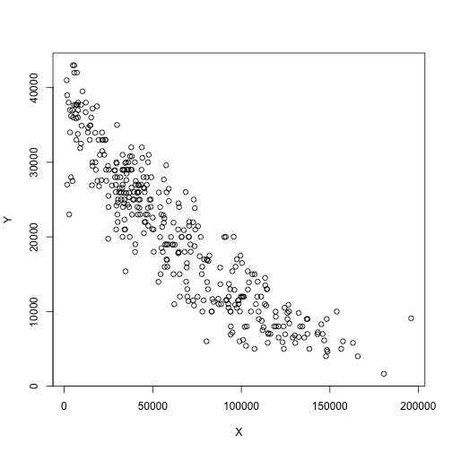

```r
library( dataWorkshop)
```

```
## Loading required package: maps
```

```
## Loading required package: fields
```

```
## Loading required package: spam
```

```
## Loading required package: grid
```

```
## Spam version 1.4-0 (2016-08-29) is loaded.
## Type 'help( Spam)' or 'demo( spam)' for a short introduction 
## and overview of this package.
## Help for individual functions is also obtained by adding the
## suffix '.spam' to the function name, e.g. 'help( chol.spam)'.
```

```
## 
## Attaching package: 'spam'
```

```
## The following objects are masked from 'package:base':
## 
##     backsolve, forwardsolve
```

```r
# fine tuning HW Quiz submission. Use  APPM2720   to begin subject line 
#  name on html/pdf/Rscript
# listing data sets.
# comments on for loops  and not using loops from Quiz1 
# e.g. converting temperatures=, converting dates. 

# trick using reshaping as a matrix to get a column of years. 


# Intro to least squares 
# as an example work with the AudiA4 data
# 

data( AudiA4)
Y<- AudiA4$price
X<- AudiA4$mileage

# finding the mean price the hard way!
# look at a sequence of points  (a) from 2000 to 40000


# analysis find out where the minimum is 


plot( X,Y)
```



```r
# a linear relationship might  more sense for mileage in the range [20K, 75K]
# Subset the data to work with this example

# brute force
# this is also incldued as a more substantial program and
# and an example of the image format
# vary slope b0 and intercept b1  over 20K to 40K and -.4 to 0  50 points each and
# store the sum of squares in the matrix S


# take a look at the surface


# add another contour close to the minimum


# the solution "by hand" using the LS formula -- see ISLR
#   b1Hat 
#   b0Hat 
   
# the solution using lm

# or  fit$lsfit( X1,Y1)

#Q2 plot the data and add the least squares line.
```

